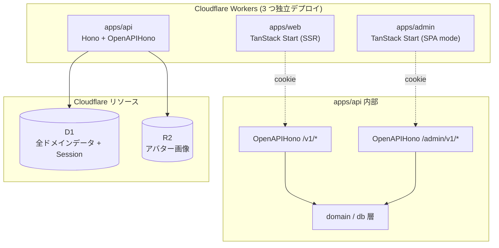
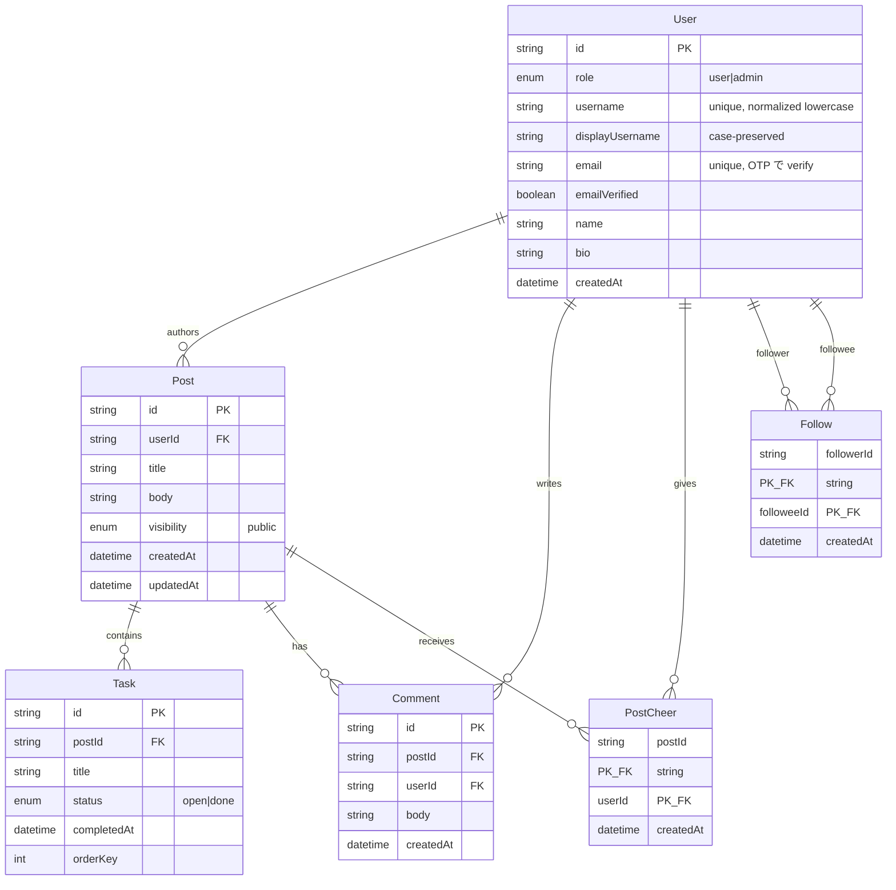

# evodo-sns 初期設計

このドキュメントは evodo-sns の **実装前の初期設計**。
何をどう作るかの予測・思考の地図であり、実装中に正解が見えてから随時更新する。
実装が一巡して構造が落ち着いたら、別途 `docs/architecture.md` を現状を反映したライブドキュメントとして作る想定。

個別機能の詳細仕様が必要な場合は、別途 `docs/superpowers/specs/YYYY-MM-DD-<feature>-design.md` のような形で追加する。

## 目次

1. プロダクトの目的と非目標
2. システム構成
3. 技術選定
4. アプリの責務と境界
5. ドメインモデル
6. データストアの役割分担
7. 認証認可
8. API 設計の方針
9. 環境とサブドメイン構成
10. 開発・運用の方針
11. 未決事項 / 拡張候補

---

## 1. プロダクトの目的と非目標

### 目的

- **学習用プロジェクト** — 様々な技術を試す場として運用する
- **公開する** — 公開運用すること自体が学習目的。誰かに使われるかは副次的
- **ある程度の規模を許容** — 機能を将来追加していく前提で、ドメイン境界を意識した設計にする

### 非目標

- 実プロダクトとしての成功（ユーザー獲得、収益化）
- 完全な可用性 / 高 SLO（学習用、落ちても直せばよい）
- マネタイズ機能（決済、サブスク）

### コア体験

- **1 投稿 = 1 TODO リスト** という形式
- 投稿はタイトル + 本文 + 複数のタスクで構成され、各タスクは open / done のチェック状態を持つ
- 投稿に対して誰でもコメントを書ける
- 投稿に対して「応援（Cheer）」を送れる

---

## 2. システム構成



3 つの Worker をそれぞれ独立した Cloudflare Workers としてデプロイする。
api worker のみが D1 / R2 binding を持つ。web / admin は API 経由でデータにアクセスする。

---

## 3. 技術選定

主要なライブラリ・サービスの一覧。採用理由は各章で個別に記載。

### Frontend (apps/web, apps/admin)

| ライブラリ              | 用途                                          |
| ----------------------- | --------------------------------------------- |
| TanStack Start          | フレームワーク（web=SSR / admin=SPA mode）    |
| TanStack Router         | クライアントサイドルーティング                |
| TanStack Query          | サーバー状態管理（orval が hooks を自動生成） |
| React 19                | UI                                            |
| Tailwind CSS v4         | スタイリング                                  |
| shadcn/ui               | UI コンポーネント（各 app に直置き）          |
| Lucide React            | アイコン                                      |
| Vite                    | ビルド・開発サーバー                          |
| @cloudflare/vite-plugin | Cloudflare Workers 向けビルド                 |

### Backend (apps/api)

| ライブラリ        | 用途                     |
| ----------------- | ------------------------ |
| Hono              | Web フレームワーク       |
| @hono/zod-openapi | OpenAPI スキーマ自動生成 |
| Zod               | スキーマ定義             |
| Better Auth       | 認証                     |
| Wrangler          | Workers のデプロイ・開発 |

### コード生成

| ツール | 用途                                                         |
| ------ | ------------------------------------------------------------ |
| orval  | OpenAPI から TanStack Query hooks を生成（生成物はコミット） |

### Cloudflare サービス

| サービス | 用途                                                           |
| -------- | -------------------------------------------------------------- |
| Workers  | Web / Admin / API のホスティング                               |
| D1       | SQLite ベースのリレーショナル DB（全ドメインデータ + Session） |
| R2       | ユーザーアバター画像                                           |

### 開発・テスト

| ツール                          | 用途                   |
| ------------------------------- | ---------------------- |
| TypeScript                      | 言語                   |
| Vitest                          | テストランナー         |
| @cloudflare/vitest-pool-workers | Workers 環境でのテスト |
| ESLint + Prettier               | Lint / フォーマット    |
| Turbo                           | モノレポビルド         |
| pnpm                            | パッケージマネージャ   |

### 未確定 / 実装時に決める

- **Markdown レンダリング**: Post body 用。`react-markdown` / `unified` 系など
- **シードデータ生成**: Faker.js などのダミーデータライブラリ
- **fractional indexing**: Task の orderKey 用ユーティリティ

### 確定済み

- **D1 ORM**: **Drizzle**（Better Auth の `@better-auth/drizzle-adapter` と整合）

---

## 4. アプリの責務と境界

### apps/web

- ユーザー向けの SNS UI
- TanStack Start の SSR モードで動作
- server functions は極力使わず、データアクセスは原則 API 経由
- 例外: 認証 cookie 読み取り、SSR 時の API プリフェッチ

### apps/admin

- 管理者向けの管理画面
- TanStack Start の SPA mode（`spa: { enabled: true }`）で動作。SSR は無効
- web と同じ Start のモード違いを体験するための構成
- ユーザー管理、シードデータ生成ツール、通報対応など運用補助機能を持つ

### apps/api

- 1 worker で public と admin を内部で分離する
- `/v1/*` を `OpenAPIHono` でマウント、`/admin/v1/*` を別の `OpenAPIHono` でマウント
- それぞれが独立した OpenAPI document を出力（`/v1/openapi.json`, `/admin/v1/openapi.json`）
- ドメイン層 / DB アクセス層は apps/api 内に閉じる
- 別 worker から DB を触る要件が出たら `packages/` への切り出しを検討する

### packages/

- 初期は空とする
- UI は各 app に shadcn を直置き、共通化は重複が痛くなってから検討
- 設定共有（`tsconfig`, `eslint-config`）も必要になってから追加

---

## 5. ドメインモデル

### エンティティと関係



### 設計上のメモ

**User**

- `username` / `displayUsername` / `email` / `emailVerified` / `role` / `banned` 等の認証関連カラムは Better Auth とそのプラグイン（`username`, `admin`）が管理
- 認証手段、登録フロー、role 設計の詳細は **`2026-05-11-auth-design.md`** を参照
- ドメイン側で持つのは `name`（表示名）と `bio`

**Post**

- 1 投稿 = 1 TODO リスト
- `visibility` カラムは持つが、v1 では `public` 固定で運用（フォーム上で選ばせない）
  - スキーマ上で enum を持っておくことで、`private` を追加する際にデータマイグレーションが不要になる
- `body` は Markdown を許容（XSS 対策はレンダリング時にサニタイズ）

**Task**

- Post に従属する。Post 削除で cascade delete
- 投稿後に追加・削除・編集・並び替えがすべて可能
- 並び替えは `orderKey`（fractional indexing 等）で管理。詳細は実装時に決める
- 編集履歴は持たない（学習用、必要になれば拡張）

**Comment**

- Post に対して誰でも書ける（自分の Post への自分のコメントも可）
- スレッド / リプライは v1 では持たない

**PostCheer**

- `(postId, userId)` の複合 PK で重複防止
- 1 ユーザーが 1 Post に 1 Cheer
- タスク単位の Cheer は持たない（v1 では Post 単位のみ）
- Like 相当のシンプルな実装で開始。リッチ化（メッセージ付き応援等）は拡張候補

**Follow**

- `(followerId, followeeId)` の複合 PK
- 双方向のフォロー（フォロワー / フォロー中）を表現
- リクエスト承認制 / ブロック等は v1 では持たない

### タイムラインの種類

- **ホーム** — フォロー中ユーザー + 自分の public Post を時系列降順
- **グローバル** — すべての public Post を時系列降順
- **ユーザー個別** — 特定ユーザーの public Post を時系列降順（プロフィール画面用）

### 「右ペインの自分のタスク」UX

レイアウト想定: 左=サイドバー / 中=タイムライン / 右=自分のタスク。
右ペインは自分が作者の Post 群から open Task を集約するクエリで実現する。新しいエンティティは要らない。

---

## 6. データストアの役割分担

| ストレージ      | 役割                            | 入れるもの                                                        |
| --------------- | ------------------------------- | ----------------------------------------------------------------- |
| **D1** (SQLite) | ドメインデータ + 認証セッション | 上記すべてのエンティティ、Better Auth の session/account テーブル |
| **R2** (Object) | バイナリ                        | ユーザーアバター画像 (`/users/{id}/avatar.webp`)                  |
| **KV** (KV)     | 高頻度の小さいキー値            | v1 では使用しない（拡張候補に保留）                               |

### 判断の根拠

- D1 で完結するうちは KV を入れない。「使うために理由を作る」のは避ける
- アバターはバイナリなので最初から R2。Post 画像添付は v1 には入れない
- KV の利用候補（レートリミット、フィードキャッシュ等）は拡張時に追加する

---

## 7. 認証認可

### ロール

- `User.role`: `user` / `admin` の 2 階層
- 拡張する場合は moderator 等を後で追加する

### 認証方式（概要）

- **Better Auth（cookie ベース）+ Email OTP + Passkey** のパスワードレス構成
- サブドメイン共有 cookie（`Domain=.evodo.hwld.dev`）で apps/web / apps/admin / apps/api 間で認証情報を共有
- ログイン UI は apps/web のみが提供。apps/admin は同一 cookie を読んで `role=admin` をガードする方式

詳細（プラグイン構成、登録フロー、メール送信、admin の境界、Cookie / セッション、Cross-subdomain 対策、Passkey 設定、環境変数、開発フロー、確定済みの判断と拡張候補）は **`2026-05-11-auth-design.md`** に記載。

### 認可境界（API 層）

| パス           | 必要な権限                           |
| -------------- | ------------------------------------ |
| `/v1/*`        | 認証済み（role ≥ user）              |
| `/admin/v1/*`  | role = admin                         |
| 一部のリソース | 所有者のみ（自分の Post の編集など） |

`/admin/v1/*` には middleware で role=admin チェックを当てて物理的に境界を引く。

---

## 8. API 設計の方針

### スキーマ駆動

- API は Zod スキーマから OpenAPI を自動生成（`@hono/zod-openapi`）
- クライアントは orval で TanStack Query hooks に変換
- orval の生成物は **コミットする** 運用

### API クライアントは各 app に同梱、共有しない

- `apps/web/src/api-client/` ← public 用
- `apps/admin/src/api-client/` ← admin 用
- 叩く API も認可境界も別なので、型レベルで分離した方が事故が減る

### orval の mutator

- cookie 付与・baseURL 設定・エラーハンドリングを担うラッパーが必要
- web / admin で別々に用意する

### エンドポイントの粒度・命名・エラーフォーマット・ページネーション

- 詳細は実装時に固める。最初の API を書く段階で原則を決めて以降踏襲する
- 当面の方針:
  - REST 風の素直な命名（`POST /v1/posts`, `GET /v1/posts/:id` など）
  - エラーは `{ error: { code, message, details? } }` の構造
  - ページネーションは cursor ベース（タイムラインは時系列なのでカーソルが自然）

---

## 9. 環境とサブドメイン構成

### local

```
http://localhost:3000   → apps/web   (vite dev)
http://localhost:3001   → apps/admin (vite dev)
http://localhost:8787   → apps/api   (wrangler dev)
```

cookie 共有のため、apps/web と apps/admin の vite proxy で `/api/*` を `localhost:8787` に転送する。
ブラウザからは同一オリジンに見えるため cookie 共有問題が発生しない。

### production

```
https://app.evodo.hwld.dev    → apps/web
https://admin.evodo.hwld.dev  → apps/admin
https://api.evodo.hwld.dev    → apps/api
```

cookie の `Domain=.evodo.hwld.dev` で 3 アプリ間で共有する。
ポートフォリオサイト本体（`hwld.dev` / `www.hwld.dev`）には影響しない。

### preview

- v1 では作らない
- 必要になったら Cloudflare の preview deployments を使う
- preview を作る場合の D1 / R2 の分け方は別途検討

### シークレット管理

- `wrangler secret put <KEY>` で各 worker に注入
- `.dev.vars` を `.gitignore`、`.dev.vars.example` をコミットして要求するキーを明示

### マイグレーション

- ORM は **Drizzle**（Better Auth の drizzle-adapter と整合）
- スキーマ生成は Better Auth CLI（`auth generate`）→ Drizzle の `drizzle-kit generate` で SQL 化
- 適用は `wrangler d1 migrations apply <db> --remote` (本番) / `--local` (ローカル)
- 認証関連の運用詳細は `2026-05-11-auth-design.md` を参照

---

## 10. 開発・運用の方針

### データ確保

- 開発時: シードデータ生成スクリプト（faker.js 等）でダミーデータを投入。これは v1 に含める
- 公開後: 自然増を待つ
- apps/admin に「N 件生成」する管理ツールを置くアイデアもあるが、v1 には入れず拡張候補に回す

### スパム / 濫用対策

- 公開する以上、雑な濫用対策は要る
- v1 では「人間ユーザーのみ」「Better Auth による sign up 制限」で十分
- レートリミット / モデレーション機能は拡張候補

### テスト戦略

- vitest + `@cloudflare/vitest-pool-workers` を使用
- 詳細粒度（ユニット / 統合 / E2E のどこに重みを置くか）は実装中に育てる
- 当面は: domain 層のユニットテスト + API のシナリオテストを最低限

### 観測性

- v1 では Cloudflare Workers 標準のログ / Analytics で開始
- 必要になればロガー / トレーシングツールを後から追加

---

## 11. 未決事項 / 拡張候補

### 機能の拡張候補

- **Post visibility = private** — 個人の作業リストを非公開にできる
- **Notification** — 応援 / コメント / フォローされたら通知
- **Tag / Category** — Post の分類、検索、フィルタ
- **Post 画像添付** — Markdown body に画像を貼れる、R2 連携
- **Reply / Mention** — Comment へのリプライ、@mention
- **Cheer のリッチ化** — メッセージ付き応援、種類分け、連続応援
- **Task の編集履歴 / Activity log**
- **DM / グループ** — スコープ外、必要になれば

### 運用の拡張候補

- **apps/admin のシードデータ生成ツール** — N 件のダミーデータを画面から生成
- **KV 利用**: レートリミット、フィードキャッシュ、OG メタキャッシュ
- **preview 環境** — Cloudflare preview deployments
- **observability ツール** — ロガー、トレーシング、エラートラッキング
- **設定共有 packages** — `tsconfig`, `eslint-config` の切り出し
- **shadcn UI の共通化** — 重複が痛くなってから
